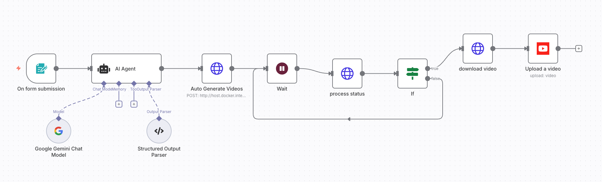

# n8n Video Automation Workflow

**Tags:** automation, n8n, API, video-generation  
**Tools:** n8n, REST API, Google Gemini Chat Model 
**Timeline:** 2025-08 

## 1) Overview
This workflow automates the process of generating videos from input video topic using n8n.  
It fetches content from a Google Gemin, processes it with MoneyPrinterTurbo to automatically generates video, and upload videos into YouTube with minimal manual intervention.  

## 2) Key Features
- Automated video generation via n8n workflow
- API integration for data retrieval and media generation
- Configurable parameters for different video formats and content
- Error handling and notification system ({{ $json.data.progress }} = 100)

## 3) Workflow Diagram

## 4) How It Works
1. Trigger node starts the process (manual for now)
2. API request node fetches content/data
3. Processing nodes prepare text, images and audio for video creation
4. Video generation API is called
5. download the output and upload video into YouTube

## 5) Results
- Enabled generate video after after video topic and upload it automatically